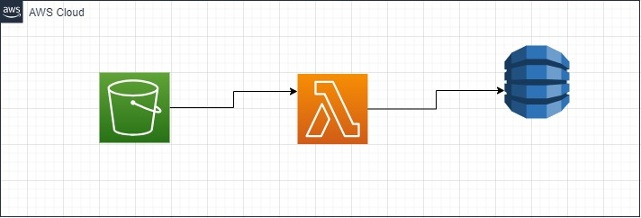

# fromCSVtoDB

i wanto to understand how to write directly from a lambda to dynamo db

i follow this [tutorial](https://dev.to/aws-builders/how-to-import-csv-data-into-dynamodb-using-lambda-and-s3-event-triggers-24io) it explain very well, but the lambda function 

in python it wasn't clear to me so I rewrote it in part , driven by test results

The project follow a simple idea : 

When i file is uploaded in a s3 bucket, it must trigger the lambda function 

that reads the file and uplad the content in dynamo db

## schema 

